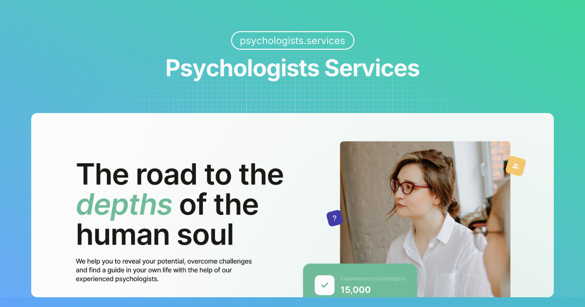

<div align="center">



# Psychologists Services

### Discover psychologists, save favorites, and book appointments in a calm, modern interface

_Built with React, TypeScript, Vite, and Firebase._


[](https://react.dev/)
[](https://www.typescriptlang.org/)
[](https://vite.dev/)
[](https://firebase.google.com/)
[](https://tanstack.com/query/latest)
[](https://www.i18next.com/)

[](https://github.com/NadiiaSavchuk2210/psychologists-services)
[](https://www.figma.com/design/I5vjNb0NsJOpQRnRpMloSY/Psychologists.Services?m=auto&t=MPhtRiTVSHH0Bl64-6)
[](https://psychologists-services-orpin.vercel.app/)


<br />


<br />

</div>

---

## ✦ Overview

**Psychologists Services** is a responsive mental health platform. It helps
users browse psychologists, compare specialists with sorting, save favorites
after authentication, and submit appointment requests through a clean modal
flow.

The product direction follows the visual language of the app itself:

- calm green-first palette
- soft, readable UI
- responsive layout from mobile to desktop
- lightweight but scalable frontend architecture
- Firebase-based persistence for auth and user actions

> [!TIP] The project already includes protected routes, persistent favorites,
> bilingual UI, form validation, and optimized production chunk splitting.

---

## ✦ Quick Navigation

| Section                                         | Description                           |
| ----------------------------------------------- | ------------------------------------- |
| [✨ Key Features](#-key-features)               | Main user-facing functionality        |
| [🗂 Project Structure](#-project-structure)     | Folder organization                   |
| [⚙ Tech Stack](#-tech-stack)                    | Core technologies used                |
| [🔥 Firebase Data Model](#-firebase-data-model) | Realtime Database and Firestore usage |
| [🚀 Quick Start](#-quick-start)                 | Setup and local launch instructions   |
| [▲ Deployment](#-deployment)                   | Vercel deployment notes               |

---
---

<a id="key-features"></a>

## ✨ Key Features

| Area                          | Highlights                                                                    |
| ----------------------------- | ----------------------------------------------------------------------------- |
| **🏠 Home Page**              | Hero section, slogan, CTA, brand-focused entry point                          |
| **🧑‍⚕️ Psychologists Catalog**  | 3 cards on first render, `Load more`, sorting by name, price, and rating      |
| **💚 Favorites Flow**         | Private favorites page, add/remove actions, persistent saved state            |
| **📅 Appointment Experience** | Expandable card details, reviews, modal form, validation, notifications       |
| **🔐 Authentication**         | Firebase registration, login, current user tracking, logout, route protection |
| **🌐 Localization**           | Ukrainian and English translations                                            |
| **🎨 UX Details**             | Theme switching, toasts, accessible modal interactions, responsive layout     |

---

<a id="project-structure"></a>

## 🗂 Project Structure

```text
psychologists-services/
├── public/                         # Icons, locales, manifest, social preview image
├── src/
│   ├── app/                        # App bootstrap, providers, routing
│   │   ├── providers/              # Auth, query client, theme providers
│   │   └── router/                 # Routes and auth guard
│   ├── assets/                     # Local images
│   ├── entities/                   # Core business entities
│   │   ├── psychologist/           # Types, API, sorting, card UI
│   │   └── user/                   # Current user model and profile UI
│   ├── features/                   # Business features
│   │   ├── auth/                   # Login and registration
│   │   ├── auth-navigation/        # Auth-aware controls in the header
│   │   ├── favorites/              # Favorites API, hooks, buttons
│   │   ├── make-appointment/       # Appointment modal and form
│   │   ├── psychologists-sort/     # Sorting UI
│   │   └── theme-switcher/         # Theme selection
│   ├── pages/                      # Route-level pages
│   │   ├── HomePage/
│   │   ├── PsychologistsPage/
│   │   ├── FavoritesPage/
│   │   ├── NotFoundPage/
│   │   └── ErrorPage/
│   ├── shared/                     # Shared UI, hooks, constants, libs, utils
│   ├── styles/                     # Global styles, reset, variables
│   └── widgets/                    # Page composition blocks
│       ├── header/
│       ├── home-hero/
│       ├── mobile-menu/
│       ├── navbar/
│       └── psychologists-list/
├── .env.example                    # Firebase environment variables template
├── package.json
└── vite.config.ts
```

---

<a id="tech-stack"></a>

## ⚙ Tech Stack

| Layer                | Tools                                                 |
| -------------------- | ----------------------------------------------------- |
| **Frontend**         | React 19, TypeScript, Vite                            |
| **Routing**          | React Router                                          |
| **Data Fetching**    | TanStack Query                                        |
| **Backend Services** | Firebase Authentication, Realtime Database, Firestore |
| **Forms**            | React Hook Form, Yup                                  |
| **State Management** | Zustand                                               |
| **Styling**          | CSS Modules, global design tokens                     |
| **UX Utilities**     | Radix UI, Framer Motion, React Hot Toast              |
| **Localization**     | i18next                                               |

---

<a id="firebase-data-model"></a>

## 🔥 Firebase Data Model

### Realtime Database

The `psychologists` collection stores the main catalog data:

- `name`
- `avatar_url`
- `experience`
- `reviews`
- `price_per_hour`
- `rating`
- `license`
- `specialization`
- `initial_consultation`
- `about`

### Firestore

- `users/{userId}/favorites/{psychologistId}` for saved psychologists
- `users/{userId}/appointments/{appointmentId}` for submitted appointment
  requests

---

<a id="quick-start"></a>

## 🚀 Quick Start

1. Clone the repository:

```bash
git clone https://github.com/NadiiaSavchuk2210/psychologists-services.git
cd psychologists-services
```

2. Install dependencies:

```bash
npm install
```

3. Create a local `.env` file from `.env.example`

4. Fill in your Firebase credentials:

```env
VITE_FIREBASE_API_KEY=
VITE_FIREBASE_AUTH_DOMAIN=
VITE_FIREBASE_DATABASE_URL=
VITE_FIREBASE_PROJECT_ID=
VITE_FIREBASE_STORAGE_BUCKET=
VITE_FIREBASE_MESSAGING_SENDER_ID=
VITE_FIREBASE_APP_ID=
VITE_PUBLIC_APP_URL=http://localhost:5173
```

5. Start development:

```bash
npm run dev
```

6. Build for production:

```bash
npm run build
```

7. Preview the production build:

```bash
npm run preview
```

---

<a id="deployment"></a>

## ▲ Deployment

The project is deployed on Vercel:

- Live demo: https://psychologists-services-orpin.vercel.app/

For correct SPA routing on direct page refresh or manual URL entry, the project includes a `vercel.json` rewrite to `index.html`. This prevents `404` responses on routes like:

- `/psychologists`
- `/favorites`

If you redeploy on Vercel after pulling the latest changes, direct navigation to nested routes should work correctly.

---

## 📜 Available Scripts

- `npm run dev` starts the Vite development server
- `npm run build` creates a production build
- `npm run lint` runs ESLint checks
- `npm run preview` previews the built app locally

---

## 👩‍💻 Author

**Nadiia Savchuk**  
Frontend Developer

[](https://github.com/NadiiaSavchuk2210)

---

**Psychologists Services © 2026 • Designed and developed by Nadiia Savchuk**
